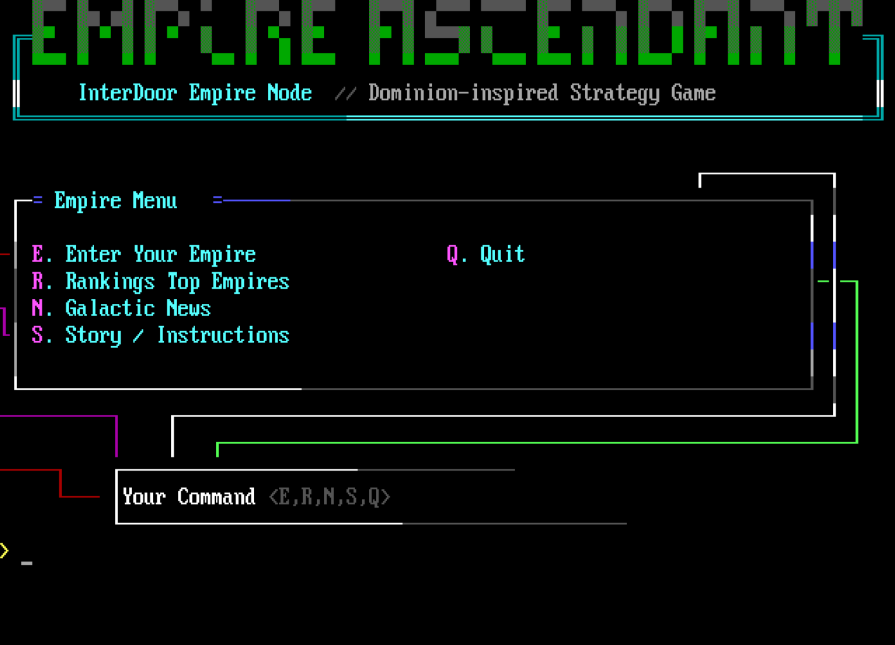

# Empire Ascendant



Empire Ascendant is a retro BBS door strategy game written in Go. It is built for terminal play, with ANSI presentation for SyncTerm and other BBS-style clients, plus a plain text fallback for simple terminals and automated checks.

Players create an empire, develop regions, build industry, manage workers and mines, bank money, raise armies, and interact with other empires through local play and InterDoor federation features.

## Current Features

- Stdio play mode for local testing and review.
- SSH listener mode for SyncTerm or a regular SSH client.
- ANSI UI enabled by default, with `-ansi=false` for plain fallback.
- SQLite persistence.
- Empire creation and daily turn reset.
- Development economy: regions, buildings, research, mines, workers, mineral sales, and banking.
- Military systems: recruitment, defenses, military research, missiles, local attacks, and spy missions.
- InterDoor foundation: node registration, heartbeat, event sync, remote roster, rankings, news, cross-node PvP, and Hyperdrive travel foundation.
- Inactive empire lifecycle tracking.

## Build

```sh
make build
```

The binary is written to:

```sh
bin/interdoor-dominion
```

The binary name is historical for now; the game identity is Empire Ascendant.

## Local Play

Plain terminal mode:

```sh
./bin/interdoor-dominion -stdio=true -db var/empireascendant.db -ansi=false
```

ANSI terminal mode:

```sh
./bin/interdoor-dominion -stdio=true -db var/empireascendant.db -ansi=true
```

## SSH / SyncTerm

Start a local SSH listener:

```sh
./bin/interdoor-dominion \
  -stdio=false \
  -addr 127.0.0.1:2324 \
  -db var/empireascendant.db \
  -ssh-host-key var/ssh_host_ed25519 \
  -ansi=true \
  -ssh-encoding=auto
```

Then connect with SyncTerm using:

- Connection type: `SSH`
- Address: `127.0.0.1`
- TCP port: `2324`
- Terminal/font: CP437-compatible settings

Regular terminal SSH clients also work with `-ssh-encoding=auto`.

## InterDoor Node Commands

The game can participate as an InterDoor node when configured with a node ID, hub URL, API key, and advertised address.

Useful flags:

```sh
-node-id ascendant
-hub-url https://example-hub.invalid
-api-key secret
-advertise-addr host.example:2324
-register
-heartbeat
-sync-once
```

These commands share the same SQLite database used by the game session.

## Verification

```sh
go test ./...
make smoke
```

## Runtime Files

Generated binaries, databases, SSH host keys, and logs are intentionally ignored by Git. Runtime state belongs under `var/` unless a deployment chooses another path.
